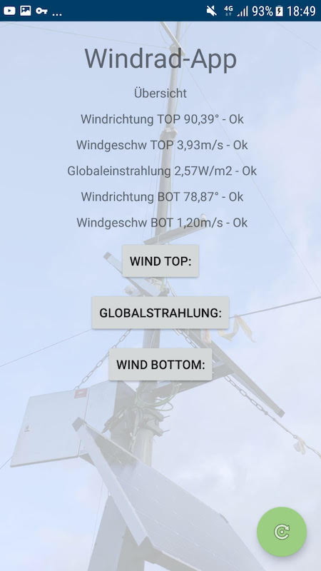
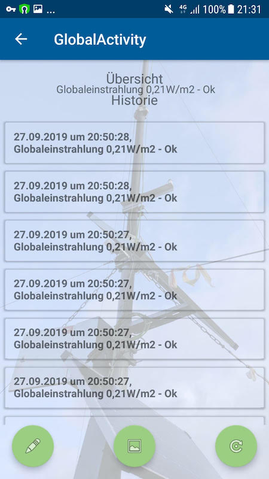

# WindPoleTracker
WindPole-Tracker with JSoup (only working with VPN of dedicated HS)

-Scrape data from Html-Website

-Make persistent entrys via SharedPreferences

-Display them in a linechart from AnyChart dependency

